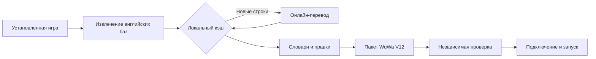

<div align="center">

# WuwaRu

Интерфейс · задания · диалоги · описания персонажей


[](LICENSE)

[](https://github.com/GishReloaded/WuWaRu/actions/workflows/ci.yml)
[](https://github.com/GishReloaded/WuWaRu/releases/latest)

Онлайн-перевод с локальным кэшем и собственным пакетом локализации WuWa V12.

[**Скачать для Windows**](https://github.com/GishReloaded/WuWaRu/releases/latest/download/WuwaRu-windows.zip) · [Установка и FAQ](docs/FAQ.md) · [Сообщить об ошибке](https://github.com/GishReloaded/WuWaRu/issues/new/choose)

</div>

---

## Возможности

- Бесплатный перевод через Google Translate или свой API с интерфейсом `chat/completions`.
- Кэш SQLite: одинаковые исходные строки переводятся один раз, остановка сохраняет прогресс.
- Извлечение текстов из установленной игры и активных официальных обновлений.
- Сохранение ID, переменных, тегов, переносов строк и структуры игровых шаблонов.
- Собственный упаковщик WuWa V12 и независимая проверка распаковкой FModelCLI.
- Установка, отключение перевода и штатный запуск через Steam или официальный EXE.

DLL не внедряются, античит не изменяется. Проект не связан с Kuro Games.

## Проверенная версия

Первый полный пакет подготовлен для ресурсов **3.7.0**, клиента **3.7.12**:

| Проверка | Результат |
| :--- | ---: |
| Базы локализации | 109 |
| Непустые исходные записи | 288 963 |
| Обработанные записи | 283 839 |
| Изменённые записи | 283 759 |
| Оставшиеся строки для перевода | 0 |

Числа, URL и технические обозначения сохраняются. Структура всех **365 428** записей проверена после распаковки; клиент подтвердил подключение пакета, пользователь — русский текст на проверенных экранах. После обновления игры совместимость нужно проверить заново. Перевод машинный; словари позволяют вручную улучшать имена и терминологию.

**В Git хранятся исходники и словари.** Извлечённые игровые базы, полный кэш и PAK остаются локально и не входят в публичный архив по умолчанию. Поэтому чистый клон создаёт свой перевод при первом запуске.

## Быстрый старт

Требуется Windows 10/11, установленная и обновлённая игра, интернет для новых переводов. Для исходников нужен Python 3.10+ с Tkinter; собранный EXE работает без Python.

### Готовая Windows-сборка

1. Скачай [WuwaRu-windows.zip](https://github.com/GishReloaded/WuWaRu/releases/latest/download/WuwaRu-windows.zip) и распакуй **весь архив** в отдельную папку.
2. Дважды щёлкни **`Setup.cmd`**, чтобы подготовить инструменты.
3. Запусти **`WuwaRu.exe`** или **`Start.cmd`**.
4. Укажи папку с `Wuthering Waves.exe`. Выбери в игре язык текста **English**.
5. Закрой игру и нажми **«Перевести и запустить»**.

Готовая сборка работает без Python. Для полного перевода выбери **«Перевести всю базу»**, затем **«Установить пакет»**. При первой установке полный кэш создаётся на твоём ПК.

### Запуск из исходников

```powershell
git clone https://github.com/GishReloaded/WuWaRu.git
cd WuWaRu
```

1. Подготовь внешний экстрактор и публичные ключи ресурсов:

   ```powershell
   powershell -NoProfile -ExecutionPolicy Bypass -File .\tools\Setup-tools.ps1
   ```

2. Запусти:

   ```powershell
   py -3.10 main.py gui
   ```

3. Укажи папку, в которой находится `Wuthering Waves.exe`. В игре выбери **язык текста English**.
4. Закрой игру и нажми **«Перевести и запустить»**.

`config.json` создаётся из `config.example.json` при первом запуске. Личные настройки не отслеживаются Git.

### Файлы релиза

| Файл | Назначение |
| :--- | :--- |
| `WuwaRu-windows.zip` | EXE, словари, исходники и установка инструментов |
| `WuwaRu-source.zip` | Исходники, документация и словари |
| `SHA256SUMS.txt` | Контрольные суммы двух архивов |

Скачивай файлы из [Releases этого репозитория](https://github.com/GishReloaded/WuWaRu/releases). Извлечённые игровые данные и полный кэш в них не входят.

| Кнопка | Действие |
| :--- | :--- |
| Перевести и запустить | Перевести заданное число новых строк, собрать, установить и запустить |
| Перевести всю базу | Обработать оставшиеся строки и собрать полный пакет |
| Остановить | Завершить обработку с сохранением кэша |
| Собрать из кэша | Собрать пакет из готовых переводов |
| Установить пакет | Подключить собранный пакет при закрытой игре |
| Отключить перевод | Удалить собственный пакет и его запись подключения |

Полный перевод большой базы может занять часы. После **«Перевести всю базу»** нажми **«Установить пакет»**. Непереведённые строки в частичном пакете остаются английскими.

Запускай игру через WuwaRu: официальное обновление может пересоздать список подключённых ресурсов. Если Steam не начал запуск автоматически, нажми «Играть» в библиотеке. Для прямого запуска Windows может запросить стандартное подтверждение UAC.

## Как это работает



На сервер перевода отправляется исходный текст локализации. Учётные данные игры программа не читает. Для неизменной базы с полным кэшем запросы на перевод не нужны.

Пакет подключается как `Lang_en/WuwaRu/pakchunk0-WuwaRu_900_P.pak` с приоритетом 900. Перед изменением `MountLang_en.txt` сохраняется локальная резервная копия; остальные записи подключения сохраняются.

## Сервисы перевода

### Бесплатный режим

По умолчанию используется веб-интерфейс Google Translate без API-ключа. Это неофициальный API: возможны ограничения запросов и изменения сервиса. При недоступности сервиса запуск использует сохранённый кэш; новые строки можно перевести позже.

### Свой API

В `config.json` настрой `api_base`, `api_model` и выбери **«API из config.json»** в окне:

```json
{
  "provider": "compatible_api",
  "api_base": "https://your-provider.example/v1",
  "api_model": "your-model",
  "api_key_env": "WUWA_TRANSLATE_API_KEY"
}
```

Это фрагмент настроек: остальные поля конфигурации сохрани. Ключ передай через переменную среды `WUWA_TRANSLATE_API_KEY` в процессе, из которого запускаешь программу. Приложение не записывает ключ в конфигурацию, кэш или пакет. Стоимость и лимиты определяются выбранным сервисом.

## Командная строка

```powershell
py -3.10 main.py extract                 # Извлечь актуальные тексты
py -3.10 main.py translate --limit 1000  # Перевести часть базы
py -3.10 main.py translate               # Перевести всю базу
py -3.10 main.py build                   # Собрать и проверить пакет
py -3.10 main.py install                 # Установить при закрытой игре
py -3.10 main.py launch                  # Перевести, собрать, установить, запустить
py -3.10 main.py uninstall               # Отключить перевод
py -3.10 main.py status                  # Показать статистику пакета
```

## Правки перевода

| Файл | Назначение |
| :--- | :--- |
| `glossary.json` | Точный перевод одинаковой исходной строки во всех местах |
| `terms.json` | Термины внутри фраз; переменные и теги не затрагиваются |
| `choices.json` | Текстовые значения вариантов Male/Female, Touch/PC/Gamepad, S/P |
| `overrides.json` | Перевод конкретной записи по ключу |

Для таблицы `MultiText` ключ в `overrides.json` — ID, например `Quest_11800001_QuestName_0_2`. Для остальных таблиц: `имя.db:Таблица:Id`, например `lang_ui.db:UiDynamicTab:4`.

После правок: **«Собрать из кэша» → «Установить пакет»** при закрытой игре. Сохраняй переменные, теги и служебные имена игровых шаблонов.

## Структура проекта

```text
WuwaRu/
├── main.py                 # GUI и CLI
├── game.py                 # Извлечение, сборка, установка, запуск
├── translator.py           # Сервисы, кэш, защита форматирования
├── wuwa_pak.py             # Собственный упаковщик WuWa V12
├── test_translation.py     # Автономные тесты
├── verify_package.py       # Проверка реальных баз после сборки
├── audit_and_repair.py     # Повторный перевод и аудит локального кэша
├── config.example.json     # Шаблон личных настроек
├── glossary.json           # Точные переводы
├── terms.json              # Терминология
├── choices.json            # Текст вариантов шаблонов
├── overrides.json          # Правки отдельных записей
├── tools/                  # Установка экстрактора и лицензии
└── .github/                # CI и шаблон отчёта об ошибке
```

Локально создаются `config.json`, `data/` и `output/`. В `data/` находятся кэш, исходные базы, журналы и резервные копии. `output/manifest.json` показывает `complete`, количество оставшихся строк и SHA-1 пакета. Эти данные исключены из Git.

## Сборка EXE

На Windows, из корня проекта:

```powershell
py -3.10 -m pip install -r requirements-dev.txt
py -3.10 -m unittest -v
py -3.10 -m PyInstaller --clean --noconfirm WuwaRu.spec
py -3.10 make_portable.py --exe dist/WuwaRu.exe --output dist/WuwaRu-windows.zip
```

Архив содержит приложение, исходники, словари и установщик инструментов. Перед первым запуском выполни `Setup.cmd`. Внешний EXE, публичные ключи и игровые данные в публичный архив не включаются.

Только исходники:

```powershell
py -3.10 make_portable.py
```

Личная переносимая копия с готовым переводом:

```powershell
py -3.10 make_portable.py --include-data --exe WuwaRu.exe
```

`--include-data` предназначен для личной резервной копии; он включает игровые базы и полный кэш. Не используй этот флаг в публичном релизе. GitHub Actions запускает тесты и собирает чистый Windows-архив без игровых данных.

## Проверки и обновления

Автономные тесты не запускают игру и не делают сетевых запросов:

```powershell
py -3.10 -m unittest -v
```

После `main.py build` можно сравнить все исходные и распакованные записи:

```powershell
py -3.10 verify_package.py
```

После обновления игры WuwaRu извлекает актуальные базы заново и сохраняет переводы одинакового исходного текста. При изменении формата ресурсов может понадобиться новый экстрактор. Обновление публичных ключей:

```powershell
powershell -NoProfile -ExecutionPolicy Bypass -File .\tools\Setup-tools.ps1 -RefreshKeys
```

## Участие и лицензия

Правки терминов и сообщения об ошибках приветствуются. См. [CONTRIBUTING.md](CONTRIBUTING.md).

Исходники WuwaRu — **GPL-3.0-or-later**, полный текст в [LICENSE](LICENSE). Происхождение внешних инструментов и ссылки на соответствующие исходники — в [THIRD_PARTY_NOTICES.md](THIRD_PARTY_NOTICES.md). Игровые ресурсы и товарные знаки принадлежат своим правообладателям.

## Поддержка

- [Установка и частые вопросы](docs/FAQ.md).
- [Совместимость и результаты проверки](docs/COMPATIBILITY.md).
- [Ошибка или неточный перевод](https://github.com/GishReloaded/WuWaRu/issues/new/choose).
- [Предложение улучшения](https://github.com/GishReloaded/WuWaRu/issues/new?template=feature_request.yml).
- [Сообщение о проблеме безопасности](SECURITY.md).

Перед отправкой скриншота скрой UID и имя аккаунта. Прикладывай только относящиеся к проблеме строки журналов.
